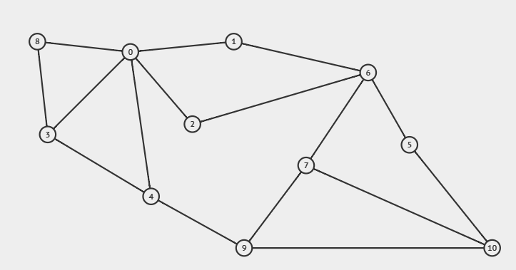

## Tugas Praktikum Pertemuan 8

### Keterangan Tugas

Berdasarkan gambar graph yang tersedia, kerjakan instruksi berikut:

1. Representasi Adjacency Matrix: Implementasikan adjacency matrix menggunakan kode program yang terdapat pada repositori GitHub.
2. Representasi Adjacency List: Implementasikan adjacency list menggunakan kode program yang terdapat pada repositori GitHub.

Laporan: Berikan penjelasan mendalam mengenai alur kode program dan analisis hasil (output) dari kedua representasi tersebut.

### Batas Pengumpulan

Deadline dari tugas adalah Selasa, 19 Mei 2026 10.15
Format pengumpulan (tidak perlu di ZIP):

- D_PSDA08_NIM_NamaLengkap.pdf
- D_PSDA08_NIM_NamaLengkap.java
