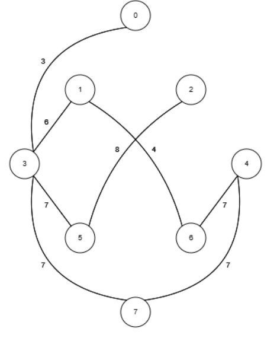

## Tugas Praktikum Pertemuan 9

### Keterangan Tugas

Berdasarkan gambar graph yang tersedia, kerjakan instruksi berikut:

Implementasikan graph diatas kedalam kode Minimum Spanning Tree menggunakan algoritma kruskal dan algoritma prim pada materi [pertemuan 9](https://github.com/ArluxSho/Prak-SDA-CD-2026/blob/main/pertemuan-9/Minimum-Spanning-Tree.md) praktikum. 

Laporan: Berikan penjelasan mendalam mengenai alur kode program dan analisis hasil (output) dari kedua representasi tersebut.

### Batas Pengumpulan

Deadline dari tugas adalah Selasa, 26 Mei 2026 22.00

Format pengumpulan (tidak perlu di ZIP):

- D_PSDA09_NIM_NamaLengkap.pdf (laporan)
- D_PSDA09_NIM_NamaLengkap.java (source code)
- D_PSDA09_NIM_NamaLengkap.zip (source code jika filenya lebih dari 1)
