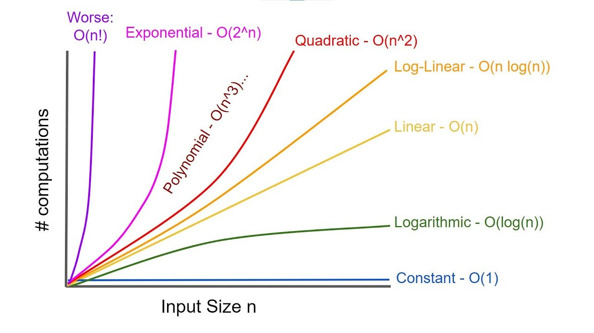

# Analisis Kompleksitas Algoritma

## 1. Pengantar

Bayangkan kalian diminta untuk memindahkan 100 barang dari suatu tempat ke tempat lain. Lalu kalian berpikir kira kira biar ga capek, harus pakai cara apa ya? Tidak mungkin bolak balik 100 kali. Pasti kalian berpikir, lebih baik pake mobil atau kendaraan sehingga bisa bawa banyak barang dalam 1 kali jalan. Kira kira seperti itu konsep dari kompleksitas dalam pemrograman. Kita tidak hanya peduli apakah sebuah program benar, tapi juga apakah program tersebut efisien.

## 2. Konsep Kompleksitas

Terdapat 2 jenis utama kompleksitas

- Time Complexity (Kompleksitas Waktu)
- Space Complexity (Kompleksitas Memori)

### 2.1 Time Complexity (Kompleksitas Waktu)

Time Complexity digunakan untuk mengukur seberapa lama suatu algoritma berjalan berdasarkan ukuran input (n), bukan dalam detik, tapi dalam jumlah operasi yang dilakukan. Contohnya seperti berapa kali loop berjalan,berapa kali perbandingan dilakukan, dan lainnya

### 2.2 Space Complexity (Kompleksitas Memori)

Space Complexity digunakan untuk mengukur berapa banyak memori tambahan yang dibutuhkan algoritma saat dijalankan. Seperti membuat variabel baru, array, rekursi, dan lainnya.

## 3. Big-O Notation

Sebenarnya terdapat banyak jenis asimtotik seperti teta dan omega, tetapi kita kan bahas Big-O. Big-O adalah cara untuk menyatakan batas atas (worst-case) dari kompleksitas algoritma.

| Fungsi Big-O | Nama       |
| ------------ | ---------- |
| O(1)         | Konstan    |
| O(log N)     | Logaritmik |
| O(N)         | Linear     |
| O(N log N)   | n log n    |
| O(N^2)       | Kuadratik  |
| O(N^m)       | Polinomial |
| O(N!)        | Faktorial  |

### 3.1 O(1) Konstan

```java
System.out.println("Selamat Datang");
```

### 3.2 O(N) Linear

```java
int i, n = 8;
for (i = 1; i <= n; i++) {
	System.out.println("Hello, world!");
}
```

### 3.3 O(N^2) Kuadratik

```java
int[] data = {1, 2, 3};

for (int i = 0; i < data.length; i++) {
    for (int j = 0; j < data.length; j++) {
        System.out.println(data[i] + " pasang dengan " + data[j]);
    }
}
```

### 3.4 O(log N) Logaritmik

```java
int n = 100;

while (n > 1) {
    n = n / 2;
    System.out.println("Sisa n: " + n);
}
```

### 3.5 O(N log N) Linearritmik

```java
int n = 8;
int totalOperasi = 0;

// Loop Luar: Berjalan n kali (O(n))
for (int i = 0; i < n; i++) {

    // Loop Dalam: Berjalan secara logaritmik (O(log n))
    int j = n;
    while (j > 1) {
        j = j / 2;
        totalOperasi++;
        System.out.println("Loop i ke-" + i + ", j sekarang: " + j);
    }
}

System.out.println("Total operasi untuk n=" + n + " adalah " + totalOperasi);
```

### Perbandingan



referensi: https://blog.stackademic.com/how-to-calculate-big-o-notation-time-complexity-5504bed8d292

## 4. Aturan Perhitungan

Sebelum masuk ke perhitungan yang lebih kompleks, kita perlu memahami bahwa analisis Big-O tidak selalu dilakukan dengan cara matematis yang rumit. Dalam praktiknya, programmer dan engineer menggunakan aturan praktis (rule of thumb) untuk memperkirakan kompleksitas secara cepat dan akurat hanya dengan membaca kode.


### 4.1 Abaikan Konstanta

```java
for (int i = 0; i < 2*n; i++) {}
```

Loop berjalan sebanyak **2n kali**, namun:

**O(2n) = O(n)**

**Reasoning:**
Saat n sangat besar, faktor konstanta (2, 5, 100, dll) tidak signifikan dibanding pertumbuhan n.

### 4.2 Ambil yang Dominan

Jika terdapat beberapa suku:

**O(n² + n) → O(n²)**

**Reasoning:**
Pertumbuhan n² jauh lebih cepat daripada n.

Contoh:

* n = 10 → n² = 100
* n = 1000 → n² = 1.000.000

### 4.3 Loop Berurutan (Sequential)

```java
for (int i = 0; i < n; i++) {}
for (int j = 0; j < n; j++) {}
```

O(n + n) = O(2n) = **O(n)**

**Insight:**
Loop tidak saling mempengaruhi → hanya dijumlahkan

### 4.4 Loop Bersarang (Nested Loop)

```java
for (int i = 0; i < n; i++) {
    for (int j = 0; j < n; j++) {}
}
```

n × n = **O(n²)**

**Insight:**
Setiap iterasi luar menjalankan seluruh loop dalam

### 4.5 Loop dengan Batas Berbeda

```java
for (int i = 0; i < n; i++) {
    for (int j = 0; j < i; j++) {}
}
```

Jumlah iterasi:
1 + 2 + 3 + ... + n = n(n+1)/2

**O(n²)**

**Insight Penting:**

> Dalam Big-O, kita fokus pada *tren pertumbuhan*, bukan jumlah pasti

## 5. Kompleksitas pada Struktur Data (Java)

### 5.1 ArrayList

ArrayList menggunakan **array dinamis**.

| Operasi      | Kompleksitas | Penjelasan     |
| ------------ | ------------ | -------------- |
| get(index)   | O(1)         | akses langsung |
| add (akhir)  | O(1)         | append         |
| add (tengah) | O(n)         | geser elemen   |
| remove       | O(n)         | geser elemen   |

```java
ArrayList<Integer> list = new ArrayList<>();
list.add(10);
list.add(20);
list.add(1, 99);
```

**Insight:**

> Operasi yang melibatkan pergeseran data = mahal

### 5.2 Stack (LIFO)

| Operasi | Kompleksitas |
| ------- | ------------ |
| push    | O(1)         |
| pop     | O(1)         |
| peek    | O(1)         |

```java
Stack<Integer> stack = new Stack<>();
stack.push(10);
stack.push(20);
stack.pop();
```

**Insight:**

> Stack efisien karena hanya bekerja di satu sisi

### 5.3 Queue (FIFO)

| Operasi | Kompleksitas |
| ------- | ------------ |
| enqueue | O(1)         |
| dequeue | O(1)         |

```java
Queue<Integer> queue = new LinkedList<>();
queue.add(10);
queue.add(20);
queue.poll();
```

**Insight:**

> Tidak perlu pergeseran data → efisien

## 6. Studi Kasus

### 6.1 Linear Search

```java
for (int i = 0; i < list.size(); i++) {
    if (list.get(i) == target) {
        return i;
    }
}
```

Kompleksitas: **O(n)**

**Insight:**
Harus memeriksa satu per satu → tidak efisien untuk data besar

### 6.2 Operasi Stack

```java
stack.push(10);
stack.pop();
```

Kompleksitas: **O(1)**

### Perbandingan

| Operasi        | Kompleksitas |
| -------------- | ------------ |
| Cari di list   | O(n)         |
| Stack push/pop | O(1)         |


## 7. Perbandingan Kompleksitas

Urutan efisiensi:

O(1) < O(log n) < O(n) < O(n²)

| Kompleksitas | Makna          |
| ------------ | -------------- |
| O(1)         | selalu cepat   |
| O(log n)     | sangat efisien |
| O(n)         | linear         |
| O(n²)        | cepat membesar |

## 8. Latihan

### Soal 1

```java
for (int i = 0; i < n; i++) {
    System.out.println(i);
}
```

### Soal 2

```java
for (int i = 0; i < n; i++) {
    for (int j = 0; j < n; j++) {
        System.out.println(i);
    }
}
```

### Soal 3 (Struktur Data)

Mana lebih efisien?

* Stack push/pop
* ArrayList insert tengah

### Soal 4

Kenapa Queue cocok untuk antrian?


## 8. Kesimpulan

* Big-O membantu memahami performa algoritma
* Tidak semua operasi memiliki biaya yang sama
* Struktur data sangat berpengaruh terhadap efisiensi

