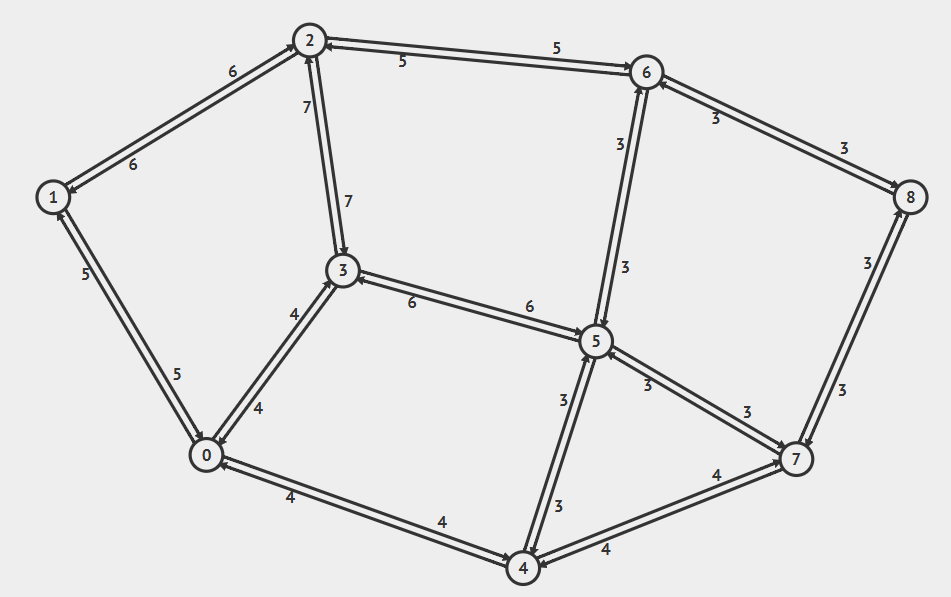

## ShortestPath - Djisktra Algorithm

### Pengenalan Algoritma Djikstra

Algoritma Dijkstra adalah salah satu algoritma paling populer dalam teori graf yang digunakan untuk mencari jalur terpendek (shortest path) dari satu titik awal (source node) ke semua titik lainnya pada sebuah graf yang berbobot (weighted graph). Djikstra menggunakan komponen utama graf seperti pertemuan kemarin yaitu Node/Vertex, Edge, dan Weight.

### Cara Kerja Utama

Algoritma Dijkstra menggunakan prinsip Greedy (Tamak). Artinya, di setiap langkahnya, algoritma ini akan selalu memilih Node terdekat yang belum dikunjungi yang memiliki bobot paling kecil saat itu.  

Secara garis besar, berikut adalah intuisi cara kerjanya:

1. Inisialisasi: Berikan jarak awal $= 0$ untuk Node asal, dan jarak tak terhingga ($\infty$) untuk semua Node lainnya (karena kita belum tahu jalurnya).
2. Pilih yang Terdekat: Lihat semua Node yang belum dikunjungi, lalu pilih Node dengan jarak total terkecil dari Node asal.
3. Pembaruan Jarak (Relaxation): Dari Node yang terpilih, periksa semua Node tetangganya yang belum dikunjungi. Hitung ulang jaraknya. Jika lewat jalur baru ini ternyata lebih dekat daripada jarak yang dicatat sebelumnya, perbarui datanya.
4. Tandai Selesai: Tandai Node yang sudah diperiksa tadi sebagai "Sudah Dikunjungi" agar tidak diproses ulang.
5. Ulangi: Lakukan terus langkah ini sampai semua Node berhasil dikunjungi.

Untuk contoh dan visualisasinya dapat dilihat di [di sini](https://www.geeksforgeeks.org/dijkstras-shortest-path-algorithm-greedy-algo-7/).
