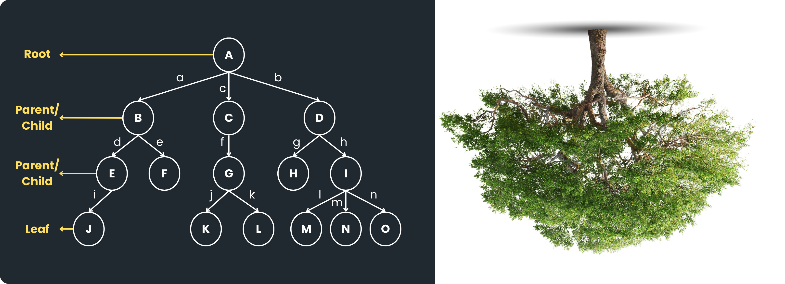
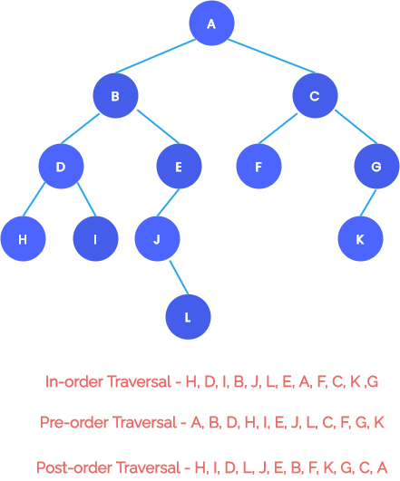

# Tree

Dalam kehidupan sehari-hari, kita sering menemukan data yang tidak tersusun secara lurus, melainkan bertingkat atau bercabang. Salah satu contoh yang paling dekat adalah struktur folder pada komputer. Sebuah folder utama dapat berisi beberapa folder lain, dan setiap folder tersebut bisa kembali memiliki isi di dalamnya. Contoh ilustrasi sederhana:

```
Documents
├── Tugas
│   └── Algo.pdf
│   └── Matdis.pdf
└── Praktikum
    └── SDA01.java
    └── OSK1.pdf
```

Dengan struktur seperti ini, terlihat jika ada hubungan bertingkat. Kalau datanya disimpan secara linier seperti dengan array list, maka hubungan antar data tidak dapat direpresentasikan dengan baik. Dalam penyimpanan data linier, tidak terlihat suatu data ini dimiliki oleh siapa. 

## 1. Definisi

Tree adalah struktur data non-linear yang digunakan untuk menyimpan data dalam bentuk hierarki atau bertingkat. Struktur ini terdiri dari sekumpulan elemen yang disebut node, di mana setiap node saling terhubung dan membentuk hubungan tertentu.

Disebut non-linear karena data tidak disusun dalam satu garis lurus seperti array atau linked list, melainkan bercabang seperti sebuah pohon. Dalam tree, terdapat satu node utama di bagian atas yang menjadi titik awal, dan dari node tersebut akan bercabang ke node-node lain di bawahnya. Tree sendiri mengambil konsep dari sebuah pohon terbalik yang digambarkan seperti berikut:



Terminologi atau istilah-istilag yang digunakan untuk memahami struktur dari tree itu sendiri. Ada beberapa istilah dalam tree:

- Node
- Root Node
- Parent Node
- Child Node
- Leaf Node

Ada juga istilah tambahan seperti:

- Edge
- Sub Tree
- Size Tree
- Height of Tree
- Deepth of Tree

### Lalu apa yang membedakan Tree dengan struktur data lainnya?


- Perbedaan tree dengan list yaitu tree disusun secara bertingkat-tingkat (hierarki) sedangkan list disusun secara lurus (linear). List hanya memiliki satu hubungan, yaitu elemen sebelum dan elemen sesudahnya, sedangkan tree memiliki hubungan bertingkat.

- Perbedaan tree dengan graph yaitu struktur tree tidak membentuk cycle sedangkan graph membentuk cycle. Pada graph, node (vertex) terhubung dengan node lain secara bebas dan tanpa batasan tertentu sedangkan tidak boleh ada cycle pada sebuat tree.

## 2. Operasi Dasar 

Note: Dalam bahasa Java, terdapat Library untuk struktur data tree yaitu TreeModel. Namun, di praktikum kita akan coba buat manual agar lebih paham terkait konsep dari Tree itu sendiri. Operasi utama pada tree ada 3, yaitu:

1. Insertion atau penambahan node
2. Deletion atau penghapus node
3. Transversal atau menjelajahi semua node, baik secara preorder maupun postorder

## 3. Traversal



Traversal pada tree umumnya dilakukan menggunakan pendekatan Depth First Search (DFS), yaitu menjelajahi satu cabang sedalam mungkin sebelum berpindah ke cabang lain. Dalam traversal DFS, terdapat beberapa cara untuk menentukan kapan sebuah node diproses. Dua di antaranya adalah:

- Preorder
- Postorder

Perbedaan keduanya terletak pada **waktu pemrosesan node.**

### Preorder Transversal

Preorder traversal adalah metode traversal di mana node diproses terlebih dahulu sebelum mengunjungi child-nya. Dengan kata lain, urutannya adalah:

```
Node → Child
```

Artinya, setiap kali kita mengunjungi sebuah node, kita langsung memprosesnya (misalnya mencetak nilainya), kemudian baru melanjutkan ke anak-anaknya. Coba berikan urutan node yang dikunjungi oleh tree berikut dengan Preorder Transversal:

```
1
├── 2
│   └── 5
├── 3
│   └── 6
│   └── 8
│       └── 10
└── 4
    └── 9
```

### Postorder Transversal

Postorder traversal adalah metode traversal di mana child diproses terlebih dahulu sebelum node. Urutannya adalah:

```
Child → Node
```

Artinya, kita harus menyelesaikan semua child dari suatu node terlebih dahulu, baru kemudian memproses node tersebut. Coba berikan urutan node yang dikunjungi oleh tree berikut dengan Postorder Transversal:

```
1
├── 2
│   └── 5
├── 3
│   └── 6
│   └── 8
│       └── 10
└── 4
    └── 9
```

## 4. Implementasi

Berikut adalah kode fullnya:

```Java
import java.util.ArrayList;

class Node{
    int data;
    ArrayList<Node> childrenNode = new ArrayList<>();

    // cunstructor
    Node(int data) {
        this.data = data;
    }

    // Method
    public void insert(Node new_node) {
        childrenNode.add(new_node);
    }

    public void remove_with_index(int index) {
        if (index < 0 || index >= childrenNode.size()) {
            System.out.println("Child node dengan index " + index + " dari parent node '" + this.data + "' tidak ditemukan di dalam range index 0 - " + childrenNode.size());
            return;
        }

        childrenNode.remove(index);
        System.out.println("Child node dari parent node '" + this.data + "' dengan index " + index + " berhasil dihapus");
    }

    private void _traversal(Node node, int depth) {
        for (int i = 0; i < depth; i++) {
            System.out.print("---");
        }
        System.out.println("> " + node.data);

        for (Node child : node.childrenNode) {
            _traversal(child, depth+1);
        }
    }

    public void traversal(){
        _traversal(this, 0);
    }

    private void _post_traversal(Node node, int depth) {
        for (Node child : node.childrenNode) {
            _post_traversal(child, depth+1);
        }
        for (int i = 0; i < depth; i++) {
            System.out.print("---");
        }
        System.out.println("> " + node.data);
    }

    public void post_traversal(){
        _post_traversal(this, 0);
    }
}

public class TreeMain {
    public static void main(String[] args) {
        Node root = new Node(25);
        Node childNode_1 = new Node(1);
        Node childNode_2 = new Node(4);
        Node childNode_3 = new Node(7);
        Node childNode_1_1 = new Node(66);
        Node childNode_1_2 = new Node(67);
        Node childNode_2_1 = new Node(100);
        Node childNode_2_2 = new Node(120);
        Node childNode_3_1 = new Node(135);
        Node childNode_3_1_1 = new Node(138);

        root.insert(childNode_1);
        root.insert(childNode_2);
        root.insert(childNode_3);
        childNode_1.insert(childNode_1_1);
        childNode_1.insert(childNode_1_2);
        childNode_2.insert(childNode_2_1);
        childNode_2.insert(childNode_2_2);
        childNode_3.insert(childNode_3_1);
        childNode_3_1.insert(childNode_3_1_1);

        root.traversal();

        System.out.println("");

        childNode_1.remove_with_index(20);
        childNode_1.remove_with_index(0);

        System.out.println("");

        root.traversal();
    }
}

```

## 5. Contoh

### a. Struktur Folder

```
project/
├── src/
│ └── index.html
| └── style.css
| └── script.js
|
├── docs/
│ └── user-stories.md
| └── backlog.md
│
└── README.md
```

### b. DOM HTML


### c. Taxonomic Categorie


## 6. Latihan

a. Jelaskan Root, Leaf, Edge, dan Height!<br>
b. Dalam algoritma Preorder Traversal, urutan langkah yang benar saat mengunjungi setiap node adalah ...<br>
c. Dalam algoritma Postorder Traversal, urutan langkah yang benar saat mengunjungi setiap node adalah ...<br>
d. Root (A) punya anak B (kiri) dan C (kanan). B punya anak D (kiri). Gambarkan dan jelaskan hasil Preorder dan Postorder traversal-nya!<br>
